# Diagrama de classes — Sistema de Matrículas

```mermaid
classDiagram
direction TB

class Usuario {
    <<abstract>>
    -String id
    -String nome
    -String login
    -String senha
    -boolean ativo
    +autenticar(String login, String senha) boolean
    +alterarSenha(String senhaAtual, String novaSenha) boolean
    +inativar() void
    +reativar() void
}

class Aluno {
    -String matricula
    -Curso curso
    +consultarMatriculas(Semestre semestre) List~Matricula~
    +adicionarMatricula(Matricula matricula) void
}

class Professor {
    -String registro
    +consultarOfertas() List~OfertaDisciplina~
    +consultarAlunosMatriculados(OfertaDisciplina oferta) List~Aluno~
    +adicionarOferta(OfertaDisciplina oferta) void
}

class Secretaria {
    -String registro
    +abrirPeriodoMatricula(PeriodoMatricula periodo) void
    +encerrarPeriodoMatricula(PeriodoMatricula periodo) void
}

class Curso {
    -String codigo
    -String nome
    -int numeroCreditos
    -boolean ativo
    +adicionarDisciplina(Disciplina disciplina, TipoDisciplina tipo) void
    +removerDisciplina(Disciplina disciplina) void
    +inativar() void
}

class Disciplina {
    -String codigo
    -String nome
    -int numeroCreditos
    -boolean ativa
    +inativar() void
}

class ComponenteCurricular {
    -String id
    -TipoDisciplina tipo
    +alterarTipo(TipoDisciplina tipo) void
}

class Semestre {
    -String id
    -int ano
    -int numero
    -StatusSemestre status
    +iniciar() void
    +encerrar() void
}

class CurriculoSemestral {
    -String id
    -LocalDate dataCriacao
    -boolean publicado
    +adicionarOferta(OfertaDisciplina oferta) void
    +removerOferta(OfertaDisciplina oferta) void
    +publicar() void
}

class OfertaDisciplina {
    -String id
    -int capacidadeMaxima = 60
    -StatusOferta status
    +consultarQuantidadeMatriculados() int
    +consultarVagasDisponiveis() int
    +possuiVaga() boolean
    +avaliarOferta() StatusOferta
    +encerrarInscricoes() void
    +liberarVaga() void
    +cancelarOferta() void
    +confirmarOferta() void
}

class PeriodoMatricula {
    -String id
    -LocalDateTime dataInicio
    -LocalDateTime dataFim
    -StatusPeriodo status
    +abrir() void
    +encerrar() void
    +estaAberto() boolean
    +validarDataAtual() boolean
}

class Matricula {
    -String id
    -LocalDateTime dataMatricula
    -LocalDateTime dataCancelamento
    -StatusMatricula status
    +confirmar() void
    +cancelar() void
    +estaAtiva() boolean
}

class NotificacaoCobranca {
    -String id
    -LocalDateTime dataEnvio
    -TipoOperacaoCobranca tipoOperacao
    -StatusNotificacao status
    -String mensagemErro
    +marcarComoEnviada() void
    +registrarFalha(String mensagem) void
}

class Repositorio {
    -List~Usuario~ usuarios
    -List~Curso~ cursos
    -List~Disciplina~ disciplinas
    -List~Semestre~ semestres
    -List~CurriculoSemestral~ curriculos
    -List~NotificacaoCobranca~ notificacoes
    +getAlunos() List~Aluno~
    +getProfessores() List~Professor~
}

class PersistenciaArquivo {
    -Path pasta
    +salvar(Repositorio repositorio) void
    +carregar(Repositorio repositorio) boolean
    +resolverPastaPadrao()$ Path
}

class AutenticacaoService {
    +autenticar(String login, String senha) Usuario
    +validarCredenciais(String login, String senha) boolean
    +cadastrarUsuario(Usuario usuario) void
    +existeLogin(String login) boolean
}

class CadastroService {
    +cadastrarCurso(String codigo, String nome, int creditos) Curso
    +cadastrarDisciplina(String codigo, String nome, int creditos) Disciplina
    +cadastrarProfessor(...) Professor
    +cadastrarAluno(...) Aluno
    +associarDisciplinaAoCurso(Curso, Disciplina, TipoDisciplina) void
    +inativarCurso(Curso) void
    +inativarDisciplina(Disciplina) void
    +inativarUsuario(Usuario) void
}

class CurriculoService {
    +criarCurriculo(Curso curso, Semestre semestre) CurriculoSemestral
    +adicionarOferta(CurriculoSemestral, Disciplina, Professor) OfertaDisciplina
    +consultarOfertasDoAluno(Aluno aluno, Semestre semestre) List~OfertaDisciplina~
    +encerrarPeriodo(Semestre semestre) void
    +avaliarOfertas(Semestre semestre) void
    +identificarAlunosAfetados(OfertaDisciplina oferta) List~Aluno~
}

class MatriculaService {
    +realizarMatricula(Aluno aluno, OfertaDisciplina oferta) Matricula
    +cancelarMatricula(Aluno aluno, Matricula matricula) boolean
    +validarPeriodo(Semestre semestre) boolean
    +validarVagas(OfertaDisciplina oferta) boolean
    +validarLimites(Aluno, Semestre, TipoDisciplina) boolean
    +validarDuplicidade(Aluno, OfertaDisciplina) boolean
}

class SistemaCobrancasGateway {
    <<interface>>
    +notificarMatricula(Aluno aluno, Semestre semestre, List~Matricula~ matriculas) boolean
    +notificarCancelamento(Aluno aluno, Semestre semestre, Matricula matricula) boolean
}

class SistemaCobrancasGatewayImpl

class TipoDisciplina {
    <<enumeration>>
    OBRIGATORIA
    OPTATIVA
}
class StatusMatricula {
    <<enumeration>>
    CONFIRMADA
    CANCELADA
}
class StatusOferta {
    <<enumeration>>
    PLANEJADA
    INSCRICOES_ABERTAS
    SEM_VAGAS
    CONFIRMADA
    CANCELADA
}
class StatusPeriodo {
    <<enumeration>>
    PLANEJADO
    ABERTO
    ENCERRADO
}
class StatusSemestre {
    <<enumeration>>
    PLANEJADO
    EM_ANDAMENTO
    ENCERRADO
}
class StatusNotificacao {
    <<enumeration>>
    PENDENTE
    ENVIADA
    FALHA
}
class TipoOperacaoCobranca {
    <<enumeration>>
    INCLUSAO
    CANCELAMENTO
}

Usuario <|-- Aluno
Usuario <|-- Professor
Usuario <|-- Secretaria

Curso "1" o-- "0..*" Aluno : possui
Curso "1" *-- "0..*" ComponenteCurricular : organiza
Disciplina "1" -- "0..*" ComponenteCurricular : integra

Curso "1" -- "0..*" CurriculoSemestral : possui
Semestre "1" -- "0..*" CurriculoSemestral : corresponde a
CurriculoSemestral "1" *-- "0..*" OfertaDisciplina : contém

Disciplina "1" -- "0..*" OfertaDisciplina : é ofertada como
Professor "1" -- "0..*" OfertaDisciplina : ministra
Semestre "1" *-- "0..1" PeriodoMatricula : possui

Aluno "1" -- "0..*" Matricula : realiza
OfertaDisciplina "1" -- "0..*" Matricula : recebe

Aluno "1" -- "0..*" NotificacaoCobranca : referente a
SistemaCobrancasGateway <|.. SistemaCobrancasGatewayImpl
MatriculaService ..> SistemaCobrancasGateway : notifica via
MatriculaService ..> NotificacaoCobranca : registra

Repositorio "1" o-- "0..*" Usuario
Repositorio "1" o-- "0..*" Curso
Repositorio "1" o-- "0..*" Disciplina
Repositorio "1" o-- "0..*" Semestre
Repositorio "1" o-- "0..*" CurriculoSemestral
Repositorio "1" o-- "0..*" NotificacaoCobranca
PersistenciaArquivo ..> Repositorio : salva / carrega

AutenticacaoService ..> Usuario : autentica
CadastroService ..> AutenticacaoService : valida login único
CurriculoService ..> CurriculoSemestral : gerencia
MatriculaService ..> Matricula : gerencia

ComponenteCurricular --> TipoDisciplina
Matricula --> StatusMatricula
OfertaDisciplina --> StatusOferta
PeriodoMatricula --> StatusPeriodo
Semestre --> StatusSemestre
NotificacaoCobranca --> StatusNotificacao
NotificacaoCobranca --> TipoOperacaoCobranca
```

## Observações

- **`Disciplina` × `OfertaDisciplina`**: a disciplina é o cadastro permanente; a oferta é a disciplina em um semestre, com professor, vagas e matrículas.
- **`Repositorio`** mantém os objetos em memória durante a execução; **`PersistenciaArquivo`** grava e lê esses objetos em arquivos `.txt` na pasta `Codigo/data`.
- A multiplicidade de matrículas por oferta é `0..*` porque as matrículas canceladas também ficam no histórico; o limite de **60 matrículas ativas** é garantido no código (`OfertaDisciplina.possuiVaga`).
