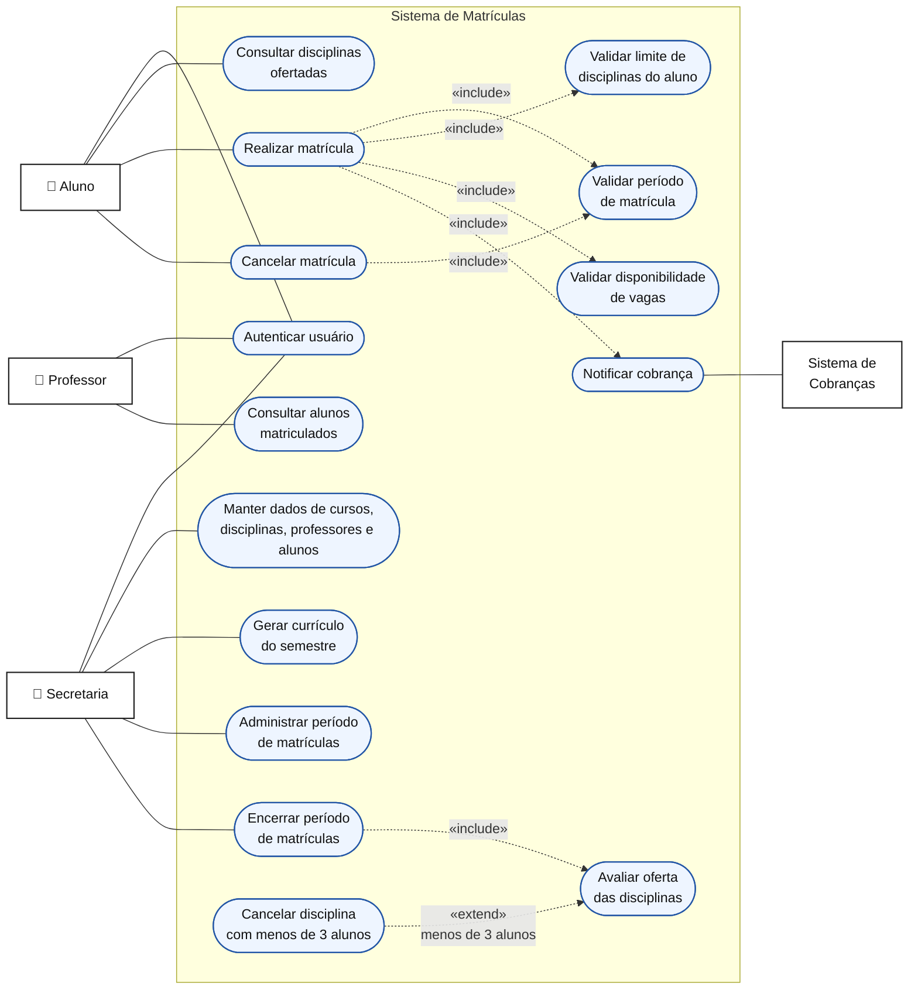

# Integrantes do grupo
*Antônio Rabelo
*Diogo Augusto
*João Pedro Bomfim Vicor
*Sofia Melo

# Sistema de Matrículas

## 1. Visão geral

Este repositório apresenta o modelo de análise de um Sistema de Matrículas para uma universidade. O sistema permite que a secretaria organize o currículo de cada semestre e mantenha os dados acadêmicos, que alunos realizem e cancelem matrículas durante o período permitido e que professores consultem os estudantes matriculados em suas disciplinas.

O sistema também controla os limites de vagas e de disciplinas por aluno, decide se uma disciplina será oferecida no semestre seguinte e notifica o sistema de cobranças sobre as matrículas realizadas.

## 2. Atores

| Ator | Responsabilidade |
|---|---|
| **Aluno** | Consultar disciplinas e realizar ou cancelar suas próprias matrículas. |
| **Professor** | Consultar os alunos matriculados nas disciplinas que ministra. |
| **Secretaria** | Manter os dados acadêmicos, elaborar o currículo semestral e administrar o período de matrículas. |
| **Sistema de Cobranças** | Receber as informações necessárias para cobrar o aluno pelas disciplinas do semestre. |

## 3. Diagrama de casos de uso

### Regras representadas no diagrama

- Toda funcionalidade restrita exige autenticação por login e senha.
- O aluno pode realizar ou cancelar matrículas somente durante o período de matrículas.
- Cada aluno pode escolher até **4 disciplinas obrigatórias** e até **2 disciplinas optativas** por semestre.
- Uma disciplina aceita no máximo **60 alunos**; ao atingir esse limite, novas matrículas são encerradas.
- Ao fim do período de matrículas, uma disciplina com menos de **3 alunos** é cancelada e não ocorre no semestre seguinte.
- Após a matrícula do aluno no semestre, o Sistema de Matrículas notifica o Sistema de Cobranças.

## 4. Histórias de usuário

### HU01 — Autenticar usuário

**Como** usuário do sistema, 
**quero** entrar com meu login e senha, 
**para** acessar com segurança as funções permitidas ao meu perfil.

**Critérios de aceitação:**

- O sistema deve permitir acesso apenas quando as credenciais forem válidas.
- O sistema deve informar quando o login ou a senha forem inválidos, sem revelar qual dos dois está incorreto.
- Após a autenticação, o usuário deve visualizar apenas as funcionalidades de seu perfil.

### HU02 — Manter dados acadêmicos

**Como** funcionário da secretaria, 
**quero** cadastrar, consultar, alterar e inativar cursos, disciplinas, professores e alunos, 
**para** manter as informações acadêmicas atualizadas.

**Critérios de aceitação:**

- O sistema deve exigir os campos obrigatórios de cada cadastro.
- Cada curso deve possuir nome, número de créditos e suas disciplinas associadas.
- O sistema não deve aceitar identificadores duplicados.
- A inativação não deve apagar o histórico acadêmico existente.

### HU03 — Gerar currículo semestral

**Como** funcionário da secretaria, 
**quero** definir as disciplinas que compõem o currículo de cada semestre, 
**para** disponibilizar a oferta acadêmica aos alunos.

**Critérios de aceitação:**

- A secretaria deve poder associar disciplinas e professores a um semestre.
- Cada disciplina da oferta deve ser identificada como obrigatória ou optativa para o curso.
- Somente disciplinas cadastradas e ativas podem integrar o currículo.
- O currículo deve ficar disponível para consulta no período correspondente.

### HU04 — Administrar o período de matrículas

**Como** funcionário da secretaria, 
**quero** definir a abertura e o encerramento do período de matrículas, 
**para** controlar quando alunos podem incluir ou cancelar disciplinas.

**Critérios de aceitação:**

- A secretaria deve poder informar as datas de início e término do período.
- O sistema deve permitir inclusões e cancelamentos somente enquanto o período estiver aberto.
- Fora do período, o sistema deve bloquear a operação e informar o motivo ao aluno.

### HU05 — Consultar disciplinas ofertadas

**Como** aluno, 
**quero** consultar as disciplinas disponíveis no semestre, 
**para** decidir em quais disciplinas desejo me matricular.

**Critérios de aceitação:**

- O sistema deve mostrar as disciplinas do currículo do semestre do aluno.
- Para cada disciplina, deve informar se ela é obrigatória ou optativa e a disponibilidade de vagas.
- Disciplinas que atingiram 60 matrículas devem aparecer como sem vagas.

### HU06 — Realizar matrícula

**Como** aluno, 
**quero** me matricular nas disciplinas do semestre, 
**para** frequentar as disciplinas escolhidas.

**Critérios de aceitação:**

- A matrícula deve ser permitida somente durante o período definido pela secretaria.
- O aluno pode selecionar no máximo 4 disciplinas obrigatórias e 2 optativas.
- O sistema não deve permitir matrícula duplicada na mesma disciplina e no mesmo semestre.
- O sistema não deve permitir matrícula em disciplina que já possua 60 alunos.
- Ao confirmar a operação, o sistema deve registrar a matrícula e atualizar a quantidade de vagas.
- O aluno deve receber uma confirmação com as disciplinas em que foi matriculado.

### HU07 — Encerrar inscrições de disciplina lotada

**Como** secretaria, 
**quero** que as inscrições de uma disciplina sejam encerradas ao atingir 60 alunos, 
**para** respeitar sua capacidade máxima.

**Critérios de aceitação:**

- Após a 60ª matrícula ativa, o sistema deve marcar a disciplina como sem vagas.
- Uma tentativa de realizar a 61ª matrícula deve ser recusada.
- Se uma matrícula for cancelada dentro do período permitido, a vaga deve voltar a ficar disponível.

### HU08 — Cancelar matrícula

**Como** aluno, 
**quero** cancelar uma matrícula realizada anteriormente, 
**para** deixar uma disciplina que não pretendo cursar.

**Critérios de aceitação:**

- O cancelamento deve ser permitido somente durante o período de matrículas.
- O aluno só pode cancelar uma matrícula própria e ativa.
- Após o cancelamento, a vaga deve ser liberada e o aluno deve receber uma confirmação.
- A alteração deve ser refletida nas informações enviadas ao Sistema de Cobranças.

### HU09 — Avaliar a oferta ao encerrar o período

**Como** funcionário da secretaria, 
**quero** encerrar o período de matrículas e avaliar a quantidade de inscritos por disciplina, 
**para** confirmar quais disciplinas ocorrerão no semestre seguinte.

**Critérios de aceitação:**

- Ao encerrar o período, o sistema deve contar apenas matrículas ativas.
- Disciplinas com 3 a 60 alunos devem ser confirmadas como ativas para o semestre.
- Disciplinas com menos de 3 alunos devem ser canceladas.
- O sistema deve identificar os alunos afetados pelo cancelamento de uma disciplina.

### HU10 — Consultar alunos matriculados

**Como** professor, 
**quero** consultar os alunos matriculados em cada disciplina que ministro, 
**para** conhecer e acompanhar minhas turmas.

**Critérios de aceitação:**

- O professor deve visualizar somente as disciplinas associadas a ele.
- A lista deve exibir apenas alunos com matrícula ativa na disciplina.
- O sistema deve atualizar a lista após uma matrícula ou um cancelamento.

### HU11 — Notificar o Sistema de Cobranças

**Como** universidade, 
**quero** enviar ao Sistema de Cobranças as matrículas do aluno no semestre, 
**para** que ele seja cobrado pelas disciplinas cursadas.

**Critérios de aceitação:**

- Após a confirmação da matrícula, o sistema deve enviar a identificação do aluno, do semestre e das disciplinas matriculadas.
- O envio deve ocorrer apenas para matrículas confirmadas.
- O sistema deve registrar se a notificação foi enviada com sucesso ou se houve falha.
- Cancelamentos realizados dentro do prazo devem gerar uma atualização para o Sistema de Cobranças.

## 5. Premissas adotadas

- A secretaria representa os usuários administrativos responsáveis pelos cadastros e pelo calendário de matrículas.
- O vínculo entre professor, disciplina e semestre é definido na elaboração do currículo semestral.
- O limite de 4 disciplinas obrigatórias e 2 optativas é aplicado individualmente a cada aluno em cada semestre.
- A notificação de cobrança é uma integração entre sistemas; o cálculo e o recebimento do pagamento estão fora do escopo deste projeto.
- A eventual realocação de alunos após o cancelamento de uma disciplina não foi especificada e, portanto, fica fora do escopo.
