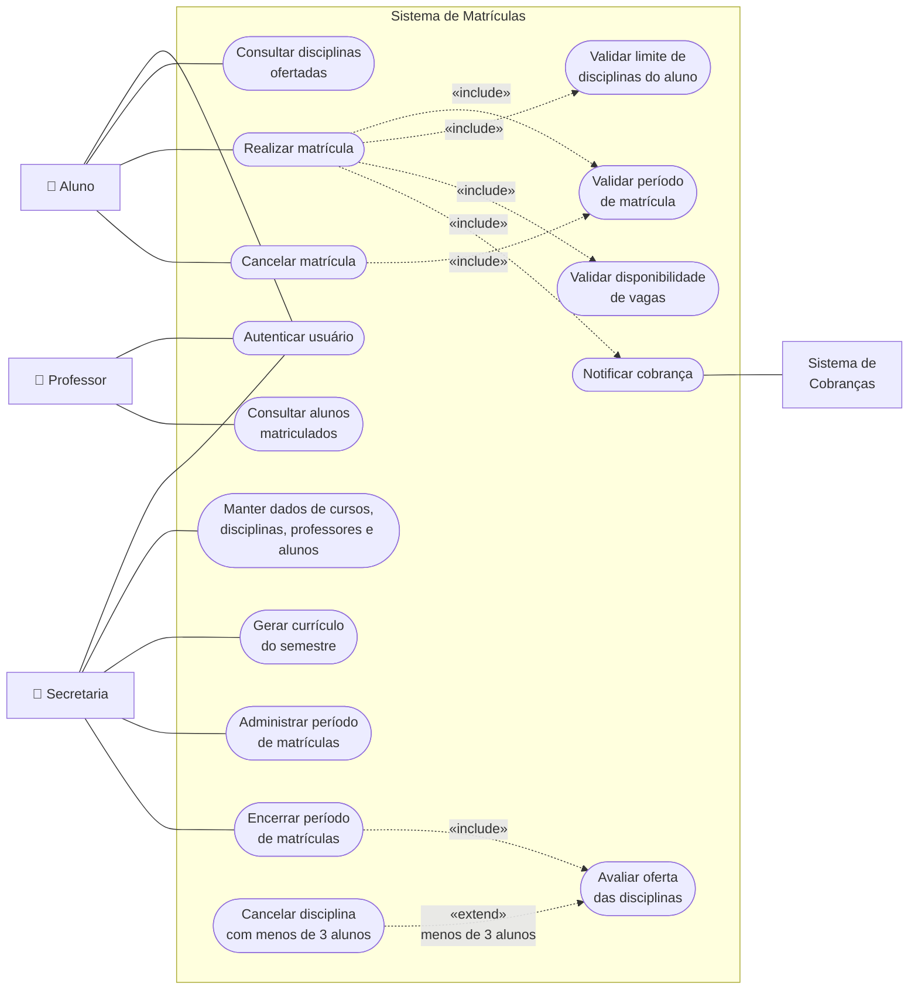

# Integrantes do grupo

Antônio Rabelo
Diogo Augusto
João Pedro Bomfim Vicor
Sofia Melo

# Sistema de Matrículas

## 1. Visão geral

Sistema de Matrículas de uma universidade, executado via terminal. A secretaria organiza o currículo de cada semestre e mantém os dados acadêmicos; alunos realizam e cancelam matrículas durante o período permitido; professores consultam os alunos matriculados em suas disciplinas.

O sistema controla os limites de vagas e de disciplinas por aluno, decide se uma disciplina será oferecida no semestre e notifica o Sistema de Cobranças sobre as matrículas e cancelamentos.

## 2. Como compilar e executar

Pré-requisito: **JDK 8 ou superior** (é preciso ter o `javac`, não apenas o `java`).

No terminal, a partir da pasta que contém a pasta `Codigo`:

**PowerShell (Windows)**

```powershell
New-Item -ItemType Directory -Force -Path out
javac -encoding UTF-8 -d out (Get-ChildItem -Path Codigo -Recurse -Filter *.java).FullName
java -cp out Codigo.Main
```

**CMD (Windows)**

```cmd
if not exist out mkdir out
dir /s /b Codigo\*.java > sources.txt
javac -encoding UTF-8 -d out @sources.txt
java -cp out Codigo.Main
```

**Linux/macOS**

```bash
mkdir -p out
javac -encoding UTF-8 -d out $(find Codigo -name "*.java")
java -cp out Codigo.Main
```

### Conta inicial

Na primeira execução, quando ainda não existe nenhum usuário salvo, o sistema cria uma conta de Secretaria:

- **login:** `secretaria`
- **senha:** `admin123`

## 3. Persistência em arquivos

Os dados são gravados em arquivos de texto na pasta **`Codigo/data`**, um arquivo por entidade:

| Arquivo | Conteúdo |
|---|---|
| `curso.txt` | Cursos |
| `disciplina.txt` | Disciplinas |
| `componente_curricular.txt` | Associação curso × disciplina × tipo (obrigatória/optativa) |
| `usuario.txt` | Secretaria, professores e alunos |
| `semestre.txt` | Semestres |
| `periodo_matricula.txt` | Período de matrículas de cada semestre |
| `curriculo_semestral.txt` | Currículo de um curso em um semestre |
| `oferta_disciplina.txt` | Ofertas (disciplina + professor + currículo) |
| `matricula.txt` | Matrículas (ativas e canceladas) |
| `notificacao_cobranca.txt` | Histórico de notificações ao Sistema de Cobranças |

**Funcionamento:**

- **Ao iniciar**, o sistema lê todos os arquivos e reconstrói os objetos e seus relacionamentos.
- **Após cada operação** dos menus (cadastro, matrícula, cancelamento etc.) e ao sair, os dados são gravados novamente.
- **Formato:** uma linha por registro, campos separados por `;`. A primeira linha de cada arquivo (iniciada por `#`) descreve as colunas.
- **Relacionamentos:** são gravados pelos identificadores (código do curso, código da disciplina, id do usuário, id da oferta etc.). Exemplo: uma linha de `matricula.txt` guarda o id do aluno e o id da oferta.
- **Segurança da gravação:** cada arquivo é gravado primeiro em um `.tmp` e só depois substitui o original, evitando arquivos corrompidos se o programa for interrompido.
- **Proteção contra perda de dados:** se algum arquivo estiver inválido na leitura, o sistema mostra o erro e encerra **sem salvar**, para não sobrescrever os dados existentes.
- **Recomeçar do zero:** basta apagar os arquivos `.txt` de `Codigo/data`.

A classe responsável é `Codigo/repository/PersistenciaArquivo.java`.

## 4. Atores

| Ator | Responsabilidade |
|---|---|
| **Aluno** | Consultar disciplinas e realizar ou cancelar suas próprias matrículas. |
| **Professor** | Consultar os alunos matriculados nas disciplinas que ministra. |
| **Secretaria** | Manter os dados acadêmicos, elaborar o currículo semestral e administrar o período de matrículas. |
| **Sistema de Cobranças** | Receber as informações necessárias para cobrar o aluno (integração simulada em `SistemaCobrancasGatewayImpl`). |

## 5. Diagrama de casos de uso


```mermaid
flowchart LR
    aluno["👤 Aluno"]
    professor["👤 Professor"]
    secretaria["👤 Secretaria"]
    cobrancas["Sistema de<br/>Cobranças"]

    subgraph sm["Sistema de Matrículas"]
        autenticar(["Autenticar usuário"])
        consultarOferta(["Consultar disciplinas<br/>ofertadas"])
        matricular(["Realizar matrícula"])
        validarPeriodo(["Validar período<br/>de matrícula"])
        validarLimites(["Validar limite de<br/>disciplinas do aluno"])
        validarVagas(["Validar disponibilidade<br/>de vagas"])
        notificar(["Notificar cobrança"])
        cancelarMatricula(["Cancelar matrícula"])
        consultarMatriculados(["Consultar alunos<br/>matriculados"])
        manterDados(["Manter dados de cursos,<br/>disciplinas, professores e alunos"])
        gerarCurriculo(["Gerar currículo<br/>do semestre"])
        administrarPeriodo(["Administrar período<br/>de matrículas"])
        encerrarPeriodo(["Encerrar período<br/>de matrículas"])
        avaliarOferta(["Avaliar oferta<br/>das disciplinas"])
        cancelarDisciplina(["Cancelar disciplina<br/>com menos de 3 alunos"])
    end

    aluno --- autenticar
    aluno --- consultarOferta
    aluno --- matricular
    aluno --- cancelarMatricula

    professor --- autenticar
    professor --- consultarMatriculados

    secretaria --- autenticar
    secretaria --- manterDados
    secretaria --- gerarCurriculo
    secretaria --- administrarPeriodo
    secretaria --- encerrarPeriodo

    matricular -. "«include»" .-> validarPeriodo
    matricular -. "«include»" .-> validarLimites
    matricular -. "«include»" .-> validarVagas
    matricular -. "«include»" .-> notificar
    cancelarMatricula -. "«include»" .-> validarPeriodo
    encerrarPeriodo -. "«include»" .-> avaliarOferta
    cancelarDisciplina -. "«extend»<br/>menos de 3 alunos" .-> avaliarOferta
    notificar --- cobrancas
```

### Regras de negócio

- Toda funcionalidade restrita exige autenticação por login e senha.
- O aluno pode realizar ou cancelar matrículas somente durante o período de matrículas.
- Cada aluno pode escolher até **4 disciplinas obrigatórias** e até **2 optativas** por semestre.
- Uma disciplina aceita no máximo **60 alunos**; ao atingir esse limite, novas matrículas são encerradas.
- Ao fim do período de matrículas, uma disciplina com menos de **3 alunos** é cancelada.
- Matrículas e cancelamentos são notificados ao Sistema de Cobranças.

## 6. Diagrama de classes

Ver `Diagrama de classes.md` (Mermaid, renderizado direto no GitHub).

## 7. Histórias de usuário × código

| História | Onde está implementada |
|---|---|
| HU01 — Autenticar usuário | `service/AutenticacaoService.java`, login em `Main.java` |
| HU02 — Manter dados acadêmicos | `service/CadastroService.java` |
| HU03 — Gerar currículo semestral | `service/CurriculoService.java` (`criarCurriculo`, `adicionarOferta`) |
| HU04 — Administrar período de matrículas | `model/PeriodoMatricula.java`, `model/Secretaria.java` |
| HU05 — Consultar disciplinas ofertadas | `CurriculoService.consultarOfertasDoAluno` |
| HU06 — Realizar matrícula | `MatriculaService.realizarMatricula` |
| HU07 — Encerrar inscrições de disciplina lotada | `OfertaDisciplina.adicionarMatricula` / `liberarVaga` |
| HU08 — Cancelar matrícula | `MatriculaService.cancelarMatricula` |
| HU09 — Avaliar a oferta ao encerrar o período | `CurriculoService.avaliarOfertas` / `identificarAlunosAfetados` |
| HU10 — Consultar alunos matriculados | `Professor.consultarAlunosMatriculados` |
| HU11 — Notificar o Sistema de Cobranças | `MatriculaService`, `gateway/SistemaCobrancasGatewayImpl.java` |
| Persistência | `repository/PersistenciaArquivo.java` |

## 8. Premissas adotadas

- A secretaria representa os usuários administrativos responsáveis pelos cadastros e pelo calendário de matrículas.
- O vínculo entre professor, disciplina e semestre é definido na elaboração do currículo semestral (oferta).
- O limite de 4 obrigatórias e 2 optativas é aplicado a cada aluno em cada semestre, considerando o tipo definido para a disciplina **no curso do aluno**.
- A notificação de cobrança é uma integração simulada; cálculo e recebimento do pagamento estão fora do escopo.
- A realocação de alunos após o cancelamento de uma disciplina não foi especificada e fica fora do escopo.
- As senhas são gravadas em texto simples em `usuario.txt`, por se tratar de um projeto acadêmico.
